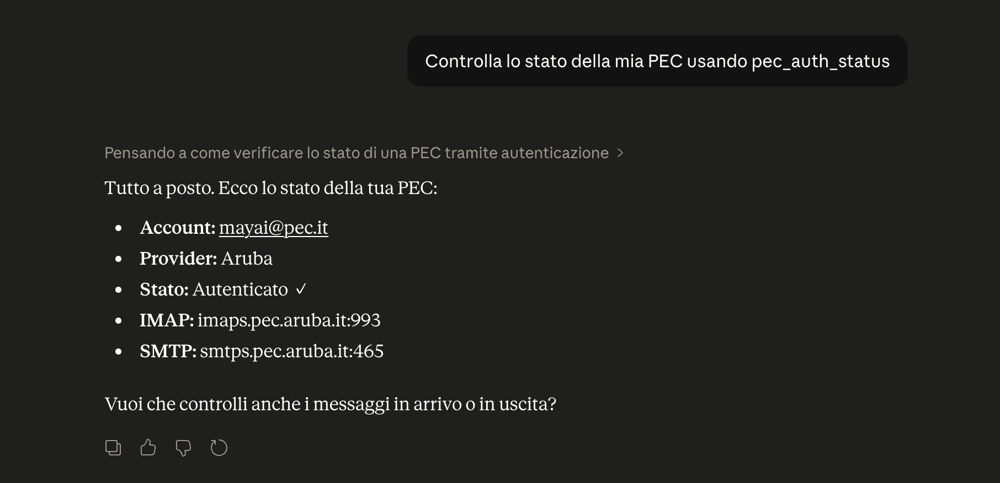

[](https://pypi.org/project/mayai-pec-cli/)
[](https://pypi.org/project/mayai-pec-cli/)
[](LICENSE)
[](https://mayai.it)
# pec-cli

Command-line client for **PEC** (Posta Elettronica Certificata — Italian
certified email), built for both humans and AI agents. Designed to be
context-efficient: the default output strips empty fields, and `--json`
produces NDJSON suitable for piping into LLMs or jq.

Talks to the standard IMAP/SMTP endpoints exposed by Italian PEC providers
(Aruba, Legalmail/InfoCert, Namirial, Register.it, Poste Italiane, Pec.it),
all over SSL/TLS.

## Why this exists

PEC (Posta Elettronica Certificata) is the legal-email standard for Italian 
businesses and professionals — used daily for invoices, official notices, 
contracts, public administration communications. Every Italian SME has one.

But programmatic access is fragmented: each provider (Aruba, Poste, 
Legalmail, Namirial, ...) ships its own SDK or webmail-only interface. 
Open-source tools that let AI agents send, receive, and track PEC messages 
are essentially non-existent.

`pec-cli` fills that gap:

- 🤖 **Agent-friendly**: NDJSON output, stable exit codes, errors on stderr 
  — pipe it into Claude, jq, or any LLM workflow.
- 👤 **Human-friendly**: compact text output, one command per common task 
  (send, list, fetch, trace).
- 🇮🇹 **Italian-native**: built for the way Italian businesses actually 
  use PEC — formal communications, legal evidence, document workflows.

Part of [MayAI](https://mayai.it).

## Requirements

- Python 3.11+
- A working PEC account from one of the supported providers

## Installation

From PyPI (recommended):

```bash
pip install mayai-pec-cli
```

The package installs a single `pec` command on your `PATH`.

From source:

```bash
git clone https://github.com/mayai-it/pec-cli.git
cd pec-cli
make install
```

For local development (adds `pytest`, `ruff`):

```bash
make dev
```

## MCP Server

pec-cli ships with a native MCP server, letting AI agents like Claude access your PEC inbox directly — no subprocess, no JSON parsing.



### Setup with Claude Desktop

Add to `~/Library/Application Support/Claude/claude_desktop_config.json`:

```json
{
  "mcpServers": {
    "pec": {
      "command": "/path/to/pec-mcp"
    }
  }
}
```

Find your path with: `which pec-mcp`

### Compatible MCP clients

pec-cli's MCP server works with any client that supports the MCP stdio transport:

| Client | Status |
|--------|--------|
| Claude Desktop | ✅ Tested |
| Cursor | ✅ Same stdio config |
| Continue (VS Code) | ✅ Same stdio config |
| Zed | ✅ Same stdio config |
| ChatGPT | ⏳ MCP support coming soon |

For clients other than Claude Desktop, the configuration format is typically the same — point the client to the `pec-mcp` executable via stdio.

### Available tools

| Tool | Description |
|------|-------------|
| `pec_list` | List messages (folder, unread_only, limit) |
| `pec_get` | Get full message with body and cert |
| `pec_send` | Send a PEC |
| `pec_trace` | Trace receipt chain by message ID |
| `pec_auth_status` | Check authentication status |

## Quick start

```bash
# 1. Authenticate (password prompted interactively, never passed as a flag)
pec auth login --address mia@pec.it --provider aruba

# 2. Verify
pec auth status

# 3. List the 20 most recent PECs in the inbox as NDJSON
pec --json list

# 4. Filter to unread, since a given date
pec --json list --unread --from 2025-01-01 --limit 50

# 5. Read a single message and save its attachments to ./attachments
pec get 1234 --save-attachments ./attachments

# 6. Inspect the parsed PEC certification (daticert.xml) for a message
pec get 1234 --cert --json

# 7. Trace the full receipt chain for an original message id
pec trace 'opec123.20260321102500.12345.67.1.1@pec.it'

# 8. Send a PEC with an attachment
pec send --to dest@pec.it --subject "Oggetto" --file body.txt --attach doc.pdf
```

## Command reference

| Command | Description |
|---|---|
| `pec auth login --address ADDR --provider P` | Prompt for password, verify via IMAP, save credentials in the system keyring (Fernet-encrypted file as fallback). |
| `pec auth status` | Show whether credentials are present. |
| `pec auth logout` | Delete saved credentials (keyring entry + any local encryption key). |
| `pec list [--folder F] [--unread] [--from YYYY-MM-DD] [--limit N]` | List PEC messages (default folder `inbox`, default limit 20). |
| `pec get <id> [--folder F] [--save-attachments DIR] [--cert]` | Fetch a single PEC by IMAP UID; `--cert` includes the parsed `daticert.xml` certification; `--save-attachments` writes attachments to `DIR`. |
| `pec trace <message-id> [--folder F] [--limit N]` | Find every receipt in the folder whose `daticert.xml` references this message id, ordered chronologically (`accettazione` → `presa-in-carico` → `avvenuta-consegna` / `errore-consegna`). |
| `pec send --to ADDR --subject S (--body T \| --file F) [--attach F] [--cc ADDR] [--dry-run] [--yes]` | Send a PEC; `--to`, `--cc`, `--attach` are repeatable. See safety note below. |

### Safety note on `pec send`

PEC has the legal value of a registered letter (raccomandata) under Italian
law. To avoid accidental sends:

- In an interactive TTY, `pec send` prompts for confirmation before contacting
  SMTP.
- In a non-TTY context (CI, pipes, scripts), `pec send` refuses to run unless
  `--yes` is passed explicitly. Exit code is `3` if the safeguard fires.
- `--dry-run` validates the message (recipient, body, attachments) and prints
  what would be sent, without contacting SMTP.
- The MCP tool `pec_send` requires `confirm_legal_send=True` and is
  rate-limited to 3 sends per recipient per 5 minutes within a session.
  Use `dry_run=True` for validation-only.

Every send carries a deterministic `Message-ID` derived from
`(from, to, cc, subject, body, minute-of-send)`, so an accidental immediate
retry of the same content produces the same id (one logical email) — pair it
with `pec trace` to follow the receipt chain.

### Resilience

IMAP and SMTP operations automatically retry on transient network errors
(socket timeouts, connection resets, server `[TRYAGAIN]` responses, SMTP
4xx codes) with exponential backoff — `1s, 2s, 4s, ...` capped at 30s,
max 3 retries (4 attempts total). Permanent failures (auth errors, SMTP
5xx, nonexistent folders) propagate immediately without looping.

SMTP retries preserve the deterministic Message-ID: the MIME envelope is
built once, before the retry loop, and reused on every attempt. That way
a PEC provider receiving the same Message-ID twice deduplicates it — one
legal communication, not two. Pass `--verbose` to see retry events on
stderr.

### Global flags

These work in any position (before or after the subcommand):

| Flag | Effect |
|---|---|
| `--json` | Emit one JSON object per line (NDJSON). |
| `--verbose` | Log IMAP/SMTP timings and certification metadata to stderr. |
| `-h`, `--help` | Show help for the current command. |

### Exit codes

| Code | Meaning |
|---|---|
| `0` | Success |
| `1` | Application error (network, send failure, bad arguments) |
| `2` | Not authenticated — run `pec auth login` |
| `3` | Refused to send: non-interactive shell without `--yes` |

## Supported providers

| Provider             | `--provider` | IMAP                          | SMTP                          |
|----------------------|--------------|-------------------------------|-------------------------------|
| Aruba PEC            | `aruba`      | `imaps.pec.aruba.it:993`      | `smtps.pec.aruba.it:465`      |
| Legalmail (InfoCert) | `legalmail`  | `imapmail.legalmail.it:993`   | `smtpmail.legalmail.it:465`   |
| Namirial             | `namirial`   | `imap.namirialpec.it:993`     | `smtp.namirialpec.it:465`     |
| Register.it          | `register`   | `imap.pec.register.it:993`    | `smtp.pec.register.it:465`    |
| Poste Italiane       | `poste`      | `imappec.poste.it:993`        | `smtppec.poste.it:465`        |
| Pec.it               | `pec.it`     | `imap.pec.it:993`             | `smtp.pec.it:465`             |

All providers use implicit SSL/TLS (IMAPS:993 / SMTPS:465). Username is the
full PEC address; the password is the one provided by the PEC provider.

## Authentication

PEC is plain IMAP/SMTP with SSL — there's no OAuth. `pec auth login`:

1. Prompts you for the password on stderr (never echoed, never on argv).
2. Verifies it by opening an IMAP connection and logging in.
3. Stores the password in the **system keyring** — macOS Keychain, Linux
   Secret Service, or Windows Credential Locker (DPAPI) — under the service
   name `mayai-cli-pec` and the PEC address as the username.
4. Writes a small metadata file at
   `~/.config/mayai-cli/pec/credentials.json` (mode `0600`) recording the
   address, provider, and where the password lives.

On headless boxes or CI where no keyring backend is available, the CLI
transparently falls back to **Fernet** encryption: a 32-byte key at
`~/.config/mayai-cli/pec/key.bin` (mode `0600`) encrypts the password inside
`credentials.json`. Existing installs that still have a `key.bin` are
migrated to the keyring on the next `pec auth login` (and `key.bin` is then
removed).

`pec auth logout` clears the keyring entry and removes the on-disk files.
The password is never written to plain disk and never accepted via a
command-line flag.

## Output format

- **Default** — compact human-readable text. Empty / null fields are stripped
  so terminal output stays scannable.
- **`--json`** — NDJSON. One object per line; lists stream one element per
  line so consumers can process incrementally.
- **`--verbose`** — adds protocol timing lines on stderr (e.g.
  `imap: connected to imaps.pec.aruba.it:993 as mia@pec.it (284ms)`), and
  surfaces the PEC certification attachments (`daticert.xml`,
  `postacert.eml`, `smime.p7s/p7m`) that are normally hidden.

Errors always go to stderr, prefixed with `error:`.

### What `pec list` returns

Each row carries the IMAP UID (`id`), a normalized ISO date, the sender, the
subject, the PEC type (`accettazione`, `consegna`, `errore`, `preavviso`, …)
when present, and read/attachment flags.

### What `pec get` returns

The full message — `from`, `to`, `cc`, `subject`, `date`, plain-text body
(HTML body too with `--verbose`), and the attachment list with each
attachment's filename and size in bytes.

PEC messages that carry a `daticert.xml` certification (every receipt and
every sent PEC) get an extra `pec_cert_type` field in the default output,
e.g. `"avvenuta-consegna"`. Pass `--cert` to also include the fully parsed
certification (`tipo`, `mittente`, `destinatari`, `data`, `identificativo`,
`riferimento_message_id`, `oggetto`, optional `errore`):

```bash
pec get 1234 --cert --json
```

By default the PEC certification files (`daticert.xml`, `postacert.eml`,
`smime.p7s`, `smime.p7m`) are filtered out of both the listed attachments
and the saved files; pass `--verbose` to include them. Use
`--save-attachments DIR` to write attachments to disk under `DIR`
(created if it doesn't exist).

### What `pec trace` returns

`pec trace <message-id>` scans recent PECs in a folder (default `inbox`,
`--limit 200`), reads each `daticert.xml`, and returns the chain whose
`riferimento_message_id` matches the given id, sorted chronologically:

```json
{
  "message_id": "opec123.20260321102500.12345.67.1.1@pec.it",
  "events": [
    {"id": "204", "tipo": "accettazione",     "data": "2026-03-21T10:25:00+01:00", "...": "..."},
    {"id": "205", "tipo": "presa-in-carico",  "data": "2026-03-21T10:25:04+01:00", "...": "..."},
    {"id": "206", "tipo": "avvenuta-consegna","data": "2026-03-21T10:25:07+01:00", "...": "..."}
  ],
  "count": 3
}
```

The argument is the certified `identificativo` of the original message — the
same value `pec get --cert` returns under `pec_cert.identificativo`. Surround
or strip `<...>` brackets as you wish; the CLI normalizes them.

## Development

```bash
make dev       # install with dev extras
make test      # run pytest
make lint      # run ruff
make clean     # remove caches and build artifacts
```

## License

MIT — see [LICENSE](./LICENSE).
